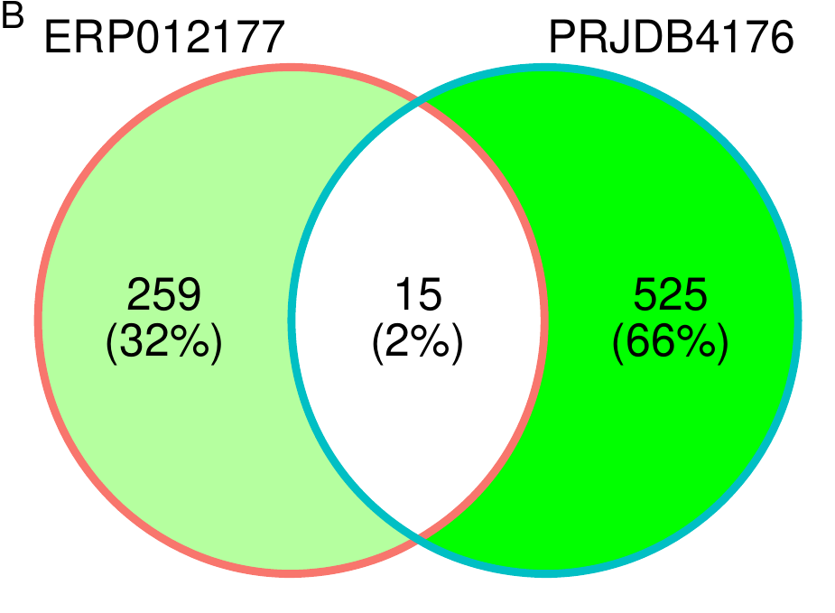

\fontsize{18}{12}\selectfont  


```{r include=FALSE}
library(magick)
library(cowplot)
image_add_labels=function(file.name=file.name,Label.size=30,label.context="A"){
  IMAGE=image_read_pdf(file.name) %>% #image_read
  image_annotate(label.context, size = Label.size, gravity = "northwest", color = "black")
  image_write(IMAGE,format = "png",path = gsub("pdf","png",file.name) )
}
```


# Background

The occurrence and development of colorectal cancer is closely related to changes in the intestinal microbiota. Current research mainly analyzes the composition and structure of patients' microbiota through high-throughput sequencing [1]. However, different analytical workflows may lead to discrepancies in the results [2], making it difficult to assess which features are more reliable [3]. 

This study employs two typical sequence classification and annotation methods: the assembly-based atlas workflow and the direct mapping-based Kraken2, to analyze the microbial composition of two public colorectal cancer datasets. By comparing the consistency and differences between the results of the two methods, their merits and limitations can be evaluated [4].

Additionally, differential analysis through Wilcoxon rank sum test and machine learning algorithms is performed to compare cancer and normal groups and identify key microbes affecting the disease [5,6]. This will lay the foundation for subsequent functional analysis and mechanism investigation of bacteria. 

The significance of this study is that by comparing results from different workflows, the performance of each method can be assessed, providing insights into obtaining more reliable disease-associated microbial markers [7]. It will also supply fundamental data for further validation in larger cohorts and mechanism research [8]. This will facilitate better understanding the intrinsic connections between colorectal cancer and microbiota, in order to develop tumor diagnostics or therapeutics based on microorganisms [9].

# Methodology 

In this study, two datasets (ERP012177 and PRJDB4176) were analyzed using the atlas and Kraken2 pipelines for microbiome analysis. First, atlas was used for assembly and binning of the sequencing data [10]. Kraken2 was then utilized to obtain taxonomic annotations [11]. The binning results from atlas and annotation outputs from Kraken2 were combined to generate a phyloseq object for downstream analyses [12].

At the genus level, microbial abundance matrices were extracted. Machine learning algorithms including 'ranger', 'xgboost', and 'decision_tree' from the ModelOriented/forester package were then applied for binary classification [13], yielding ROC curves and identifying differentially abundant features [14]. Additionally, Wilcoxon rank sum test was used to analyze differences between the two groups and determine features with the largest differences (P<0.05) [15].

In summary, this study compared the microbiomes of two datasets through assembly, annotation, and machine learning approaches, revealing differentially abundant microbial features between the groups. This provides insights into understanding shifts in microbial composition and functions.


# Figure1 Overall

# Figure2 ML


## ERP012177

### ROC


```{r include=FALSE}
file.name="../../Analysis_shotgun_ERP012177/03_ML/shotgun/atlas_binning/ERP012177_binning_best.model_draw_Roc_plot.pdf"
image_add_labels(file.name,label.context = "A")

file.name="../../Analysis_shotgun_ERP012177/03_ML/shotgun/krakens/ERP012177_best.model_draw_Roc_plot.pdf"
image_add_labels(file.name,label.context = "B")

```


{width=50% height=50%}
{width=50% height=50%}


<div style="display: flex; flex-direction: row;">
  <iframe src="../../Analysis_shotgun_ERP012177/03_ML/shotgun/atlas_binning/ERP012177_binning_best.model_draw_Roc_plot.png" width="50%" height="500px"></iframe>
  <iframe src="../../Analysis_shotgun_ERP012177/03_ML/shotgun/krakens/ERP012177_best.model_draw_Roc_plot.png" width="50%" height="500px"></iframe>
</div>

图1:ERP012177 atlas binning.                                          图2: ERP012177 krakens

### Feature_importance

```{r include=FALSE}
file.name="../../Analysis_shotgun_ERP012177/03_ML/shotgun/atlas_binning/ERP012177_binning_best.model_draw_feature_importance_plot.pdf"
image_add_labels(file.name,label.context = "A")

file.name="../../Analysis_shotgun_ERP012177/03_ML/shotgun/krakens/ERP012177_best.model_draw_feature_importance_plot.pdf"
image_add_labels(file.name,label.context = "B")

```

{width=50% height=50%}
{width=50% height=50%}

<div style="display: flex; flex-direction: row;">
  <iframe src="../../Analysis_shotgun_ERP012177/03_ML/shotgun/atlas_binning/ERP012177_binning_best.model_draw_feature_importance_plot.png" width="50%" height="500px"></iframe>
  <iframe src="../../Analysis_shotgun_ERP012177/03_ML/shotgun/krakens/ERP012177_best.model_draw_feature_importance_plot.png" width="50%" height="500px"></iframe>
</div>

图1:ERP012177 atlas binning.                                          图2: ERP012177 krakens


## PRJDB4176

### ROC
```{r include=FALSE}
file.name="../../Analysis_shotgun_PRJDB4176/03_ML/shotgun/atlas_binning/PRJDB4176_binning_best.model_draw_Roc_plot.pdf"
image_add_labels(file.name,label.context = "A")

file.name="../../Analysis_shotgun_PRJDB4176/03_ML/shotgun/krakens/PRJDB4176_best.model_draw_Roc_plot.pdf"
image_add_labels(file.name,label.context = "B")
```

{width=50% height=50%}
{width=50% height=50%}


<div style="display: flex; flex-direction: row;">
  <iframe src="./../Analysis_shotgun_PRJDB4176/03_ML/shotgun/atlas_binning/PRJDB4176_binning_best.model_draw_Roc_plot.png" width="50%" height="500px"></iframe>
    <iframe src="../../Analysis_shotgun_ERP012177/03_ML/shotgun/krakens/ERP012177_best.model_draw_Roc_plot.png" width="50%" height="500px"></iframe>
</div>


### Feature_importance
```{r include=FALSE}
file.name="../../Analysis_shotgun_PRJDB4176/03_ML/shotgun/atlas_binning/PRJDB4176_binning_best.model_draw_feature_importance_plot.pdf"
image_add_labels(file.name,label.context = "A")

file.name="../../Analysis_shotgun_PRJDB4176/03_ML/shotgun/krakens/PRJDB4176_best.model_draw_feature_importance_plot.pdf"
image_add_labels(file.name,label.context = "B")

```

{width=50% height=50%}
{width=50% height=50%}


<div style="display: flex; flex-direction: row;">
  <iframe src="./../Analysis_shotgun_PRJDB4176/03_ML/shotgun/atlas_binning/PRJDB4176_binning_best.model_draw_feature_importance_plot.png" width="50%" height="500px"></iframe>
    <iframe src="../../Analysis_shotgun_ERP012177/03_ML/shotgun/krakens/PRJDB4176_best.model_draw_feature_importance_plot.png" width="50%" height="500px"></iframe>
</div>

# Figure3 Wilcoxon

## ERP012177

```{r include=FALSE}
file.name="../../Analysis_shotgun_ERP012177/04_Wilcoxon/atlas/output/class_ERP012177_pvalue0.05case_control_metagenomics.pdf"
image_add_labels(file.name,label.context = "A")

file.name="../../Analysis_shotgun_ERP012177/04_Wilcoxon/Kraken2/output/class_ERP012177_pvalue0.05case_control_metagenomics.pdf"
image_add_labels(file.name,label.context = "B")

```


{width=50% height=50%}
{width=50% height=50%}


<div style="display: flex; flex-direction: row;">
  <iframe src="../../Analysis_shotgun_ERP012177/04_Wilcoxon/atlas/output/class_ERP012177_pvalue0.05case_control_metagenomics.png" width="50%" height="500px"></iframe>
  <iframe src="../../Analysis_shotgun_ERP012177/04_Wilcoxon/Kraken2/output/class_ERP012177_pvalue0.05case_control_metagenomics.png" width="50%" height="500px"></iframe>
</div>


## PRJDB4176

```{r include=FALSE}
file.name="../../Analysis_shotgun_PRJDB4176/04_Wilcoxon/atlas/output/class_PRJDB4176_pvalue0.05Stage.III.IV._Healthy.control_metagenomics.pdf"
image_add_labels(file.name,label.context = "A")

file.name="../../Analysis_shotgun_PRJDB4176/04_Wilcoxon/Kraken2/output/class_PRJDB4176_pvalue0.05Stage.III.IV._Healthy.control_metagenomics.pdf"
image_add_labels(file.name,label.context = "B")

```
{width=50% height=50%}
{width=50% height=50%}


<div style="display: flex; flex-direction: row;">
  <iframe src="../../Analysis_shotgun_PRJDB4176/04_Wilcoxon/atlas/output/class_PRJDB4176_pvalue0.05Stage.III.IV._Healthy.control_metagenomics.png" width="50%" height="500px"></iframe>
    <iframe src="../../Analysis_shotgun_PRJDB4176/04_Wilcoxon/Kraken2/output/class_PRJDB4176_pvalue0.05Stage.III.IV._Healthy.control_metagenomics.png" width="50%" height="500px"></iframe>
</div>


# Figure4 Venny
```{r include=FALSE}
file.name="../../Venny/Atlas_wilcox_venny.pdf"
image_add_labels(file.name,label.context = "A",Label.size = 10)

file.name="../../Venny/Kraken2_wilcox_venny.pdf"
image_add_labels(file.name,label.context = "B",Label.size = 10)

```

{width=50% height=50%}
{width=50% height=50%}


<div style="display: flex; flex-direction: row;">
  <iframe src="../../Venny/Atlas_wilcox_venny.png" width="50%" height="500px"></iframe>
    <iframe src="../../Venny/Kraken2_wilcox_venny.png" width="50%" height="500px"></iframe>
</div>


References:

[1] Zeller G, et al. Potential of fecal microbiota for early‐stage detection of colorectal cancer. Mol Syst Biol. 2014;10:766.

[2] Jovel J, et al. Characterization of the gut microbiome using 16S or shotgun metagenomics. Front Microbiol. 2016;7:459. 

[3] Yachida S, et al. Metagenomic and metabolomic analyses reveal distinct stage-specific phenotypes of the gut microbiota in colorectal cancer. Nat Med. 2019;25:968-76.

[4] Lindgreen S, et al. An evaluation of the accuracy and speed of metagenome analysis tools. Sci Rep. 2016;6:19233.

[5] Wirbel J, et al. Meta-analysis of fecal metagenomes reveals global microbial signatures that are specific for colorectal cancer. Nat Med. 2019;25:679-89. 

[6] Thomas AM, et al. Metagenomic analysis of colorectal cancer datasets identifies cross-cohort microbial diagnostic signatures and a link with choline degradation. Nat Med. 2019;25:667-78.

[7] Flemer B, et al. Tumour-associated and non-tumour-associated microbiota in colorectal cancer. Gut. 2017;66:633-43. 

[8] Gao R, et al. Colorectal cancer-associated microbiota contributes to oncogenic epigenetic signatures. Nat Commun. 2019;10:4285.

[9] Zitvogel L, et al. The microbiome in cancer immunotherapy: Diagnostic tools and therapeutic strategies. Science. 2018;359:1366-70. 

[10] Nayfach S, et al. New insights from uncultivated genomes of the global human gut microbiome. Nature. 2019;568:505-10.

[11] Wood DE, Salzberg SL. Kraken: ultrafast metagenomic sequence classification using exact alignments. Genome Biol. 2014;15:R46.

[12] McMurdie PJ, Holmes S. phyloseq: an R package for reproducible interactive analysis and graphics of microbiome census data. PLoS One. 2013;8:e61217.

[13] Wright MN, Ziegler A. ranger: A Fast Implementation of Random Forests for High Dimensional Data in C++ and R. J Stat Softw. 2017;77:1-17.

[14] Kuhn M. Building predictive models in R using the caret package. J Stat Softw. 2008;28:1-26.

[15] Derrac J, et al. A practical tutorial on the use of nonparametric statistical tests as a methodology for comparing evolutionary and swarm intelligence algorithms. Swarm Evol Comput. 2011;1:3-18.
